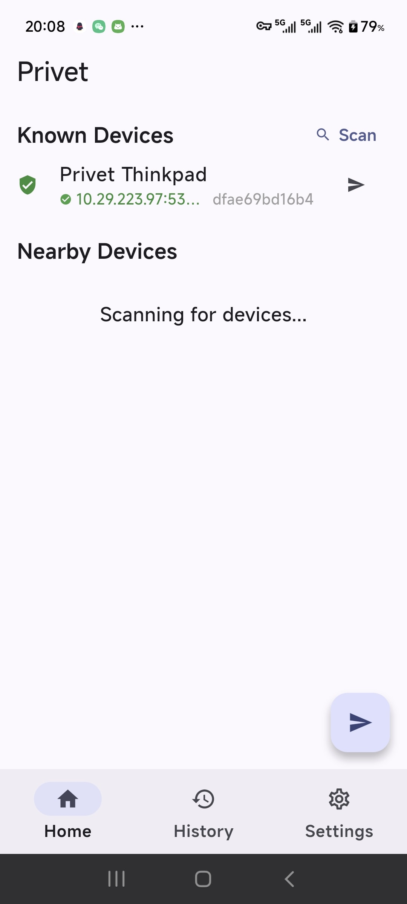
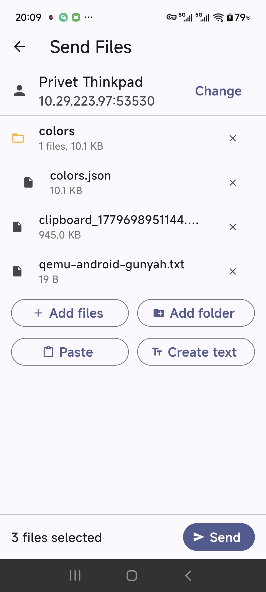
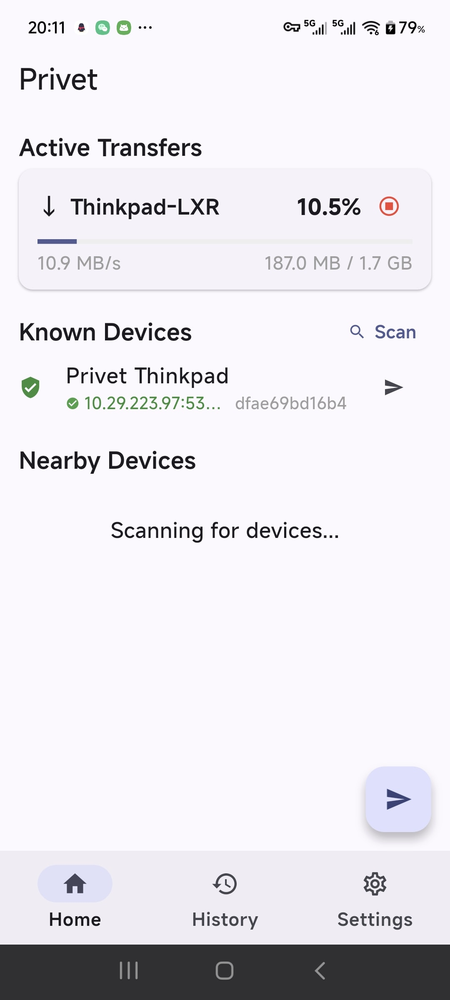
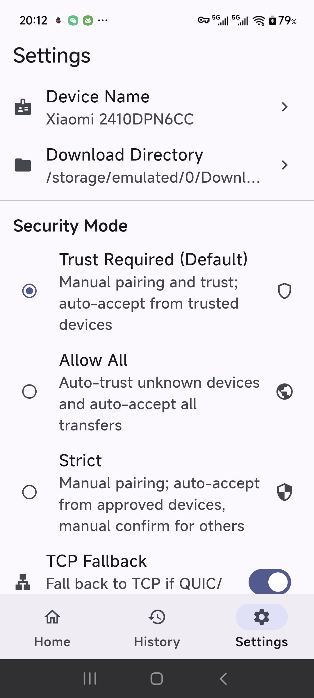

# Privet

**Fast, secure LAN file transfer with QUIC.** Cross-platform GUI (Flutter) + CLI (Rust).

[](LICENSE)

---

## Background

Existing LAN transfer tools like LocalSend use HTTP/TCP, which degrades sharply under packet loss. In campus and enterprise networks where Wi-Fi loss rates of 5–10% are common, Cubic congestion control can reduce TCP throughput to a crawl.

Privet tackles this with **QUIC** transport, a Rust core engine, and a multi-layered peer discovery strategy. The result is reliable, high-speed transfers even on lossy, multicast-restricted networks.

## Goals

- Maximize transfer throughput on lossy LANs via QUIC
- Cross-platform: Windows, Linux, macOS, Android, iOS
- CLI-first Linux support for headless servers and compute clusters
- Automatic peer discovery via mDNS, UDP beacon, and subnet scanning
- TLS 1.3 mutual authentication with pairing codes

## Non-Goals

- No cloud relay or NAT traversal server
- No file storage or sync — transfers are direct P2P only
- No instant messaging or chat

---

## Features

### Transport

- **QUIC** — primary transport, excels under packet loss
- **TCP+TLS fallback** — automatic when UDP is blocked
- **Concurrent streams** — multiple files transfer in parallel
- **Resume support** — incomplete transfers continue from last byte (core)
- **Cancel at any time** — from either sender or receiver

### Discovery

- **mDNS** — standard multicast DNS (`_privet._udp.local.`)
- **UDP beacon** — broadcast on port 53531 (bypasses mDNS restrictions)
- **TCP probe** — directed connection to known device IPs
- **Subnet scanner** — CIDR sweep for open Privet ports

### Security

- **mTLS 1.3** — all traffic encrypted with rustls
- **Device fingerprint** — SHA-256 of self-signed certificate
- **6-digit pairing code** — symmetric verification during first contact
- **Three trust modes** — Allow All / Trust Required (default) / Strict

### File Transfer

- **Files and folders** — recursive directory handling with dedup naming
- **File picker** — multi-file selection
- **Clipboard paste** — text, images and file paths (Windows / Linux / Android)
- **Share-to** — Android Intent receive
- **Transfer history** — browsable log of completed transfers
- **Drag & drop** — not yet implemented

### Platforms

| GUI | CLI | Status |
|---|---|---|
| Windows | ✔ | Verified |
| Android | — | Verified |
| Linux | ✔ | Verified |
| macOS | ✔ | Not built |
| iOS | — | Not built |

---

## Screenshots

| Home | Send | Receive | Settings |
|---|---|---|---|
|  |  |  |  |

---

## Architecture

```
┌─────────────────────────────────────────────────────┐
│ Flutter UI (privet_app)                             │
│  Riverpod ←→ PrivetService ←→ PrivetFfiIsolate     │
└───────────────────────┬─────────────────────────────┘
                        │ dart:ffi
┌───────────────────────▼─────────────────────────────┐
│ privet-ffi (C FFI bridge)                           │
└───────────────────────┬─────────────────────────────┘
                        │ extern "C"
┌───────────────────────▼─────────────────────────────┐
│ privet-core (Rust engine)                           │
│  ┌──────────┐ ┌──────────┐ ┌──────────────────┐     │
│  │Discovery │ │Transfer  │ │Security          │     │
│  │ · mDNS   │ │ · QUIC   │ │ · mTLS 1.3       │     │
│  │ · Beacon │ │ · TCP    │ │ · Fingerprint    │     │
│  │ · Probe  │ │ · Resume │ │ · Pairing code   │     │
│  │ · Scanner│ │ · Cancel │ │ · Trust store    │     │
│  └──────────┘ └──────────┘ └──────────────────┘     │
│  ┌──────────┐ ┌──────────┐ ┌──────────────────┐     │
│  │Protocol  │ │Storage   │ │Network           │     │
│  │ · QUIC   │ │ · Config │ │ · Subnet detect  │     │
│  │ · TCP    │ │ · Logs   │ │ · Known devices  │     │
│  └──────────┘ └──────────┘ └──────────────────┘     │
└─────────────────────────────────────────────────────┘
┌─────────────────────────────────────────────────────┐
│ privet-cli (Rust binary)                            │
│  send / receive / discover / pair / history         │
└─────────────────────────────────────────────────────┘
```

See `CLAUDE.md` for detailed module maps and data flow.

---

## Quick Start

### Prerequisites

- [Rust](https://rustup.rs/) stable
- [Flutter](https://flutter.dev/)
- Windows: [Visual Studio 2022](https://visualstudio.microsoft.com/) with C++ toolchain
- Linux: `sudo apt install cmake ninja-build clang pkg-config libgtk-3-dev`

### Build

```bash
# Rust engine and CLI
cargo build --release --workspace

# Flutter GUI
cd privet_app

# Windows
flutter build windows --release

# Linux
flutter build linux --release

# Android
./scripts/build-android-rust.sh
flutter build apk --release
```

### Windows Installer

```bash
cargo build --release -p privet-ffi
flutter build windows --release
ISCC.exe scripts\innosetup.iss
```

### Linux Package (.deb)

```bash
cargo build -p privet-ffi --release
cd privet_app && flutter build linux --release && cd ..
bash scripts/build-deb.sh
sudo dpkg -i dist/privet_*.deb
```

> The `.deb` package depends on `xclip` (X11 clipboard file/image paste) and `wl-clipboard` (Wayland clipboard support).

### CLI Usage

```bash
# Discover peers on LAN
privet discover

# Send files (interactive peer selection in CLI mode)
privet send ./photos/ ./report.pdf -t XX.XX.XX.XXX:53530

# Receive files (daemon mode prints pairing codes)
privet receive --output ~/Downloads

# Manage trusted devices
privet pair list
privet pair trust <fingerprint>

# View transfer history
privet history
```

---

## Project Structure

```
├── privet-core/       # Rust engine library
├── privet-ffi/        # C FFI bindings for Flutter
├── privet-cli/        # CLI binary
├── privet-tests/      # Integration tests
├── privet_app/        # Flutter cross-platform GUI
│   ├── lib/           # Dart source
│   └── android/       # Android platform
│       windows/       # Windows platform
│       linux/         # Linux platform
│       macos/         # macOS platform
├── scripts/           # Build and packaging scripts
└── screenshots/       # UI screenshots
```

---

## License

GNU General Public License v3.0 or later. See [LICENSE](LICENSE).
