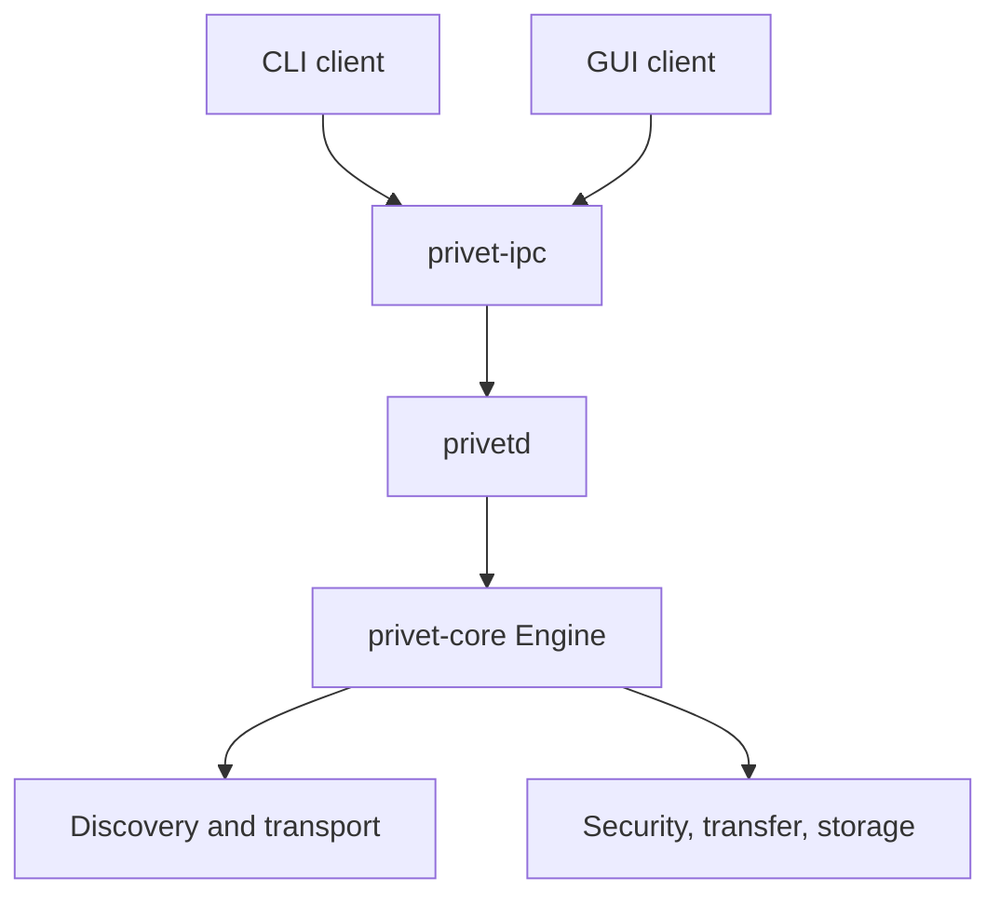

# 00 — System Architecture and Product Boundary

Status: implemented baseline, protocol version 1, storage schema version 1, IPC version 1.

## 1. Purpose

Privet is a one-to-one file and directory transfer system for devices reachable on the same local network. The system discovers peers locally, establishes an encrypted transport, pairs previously unknown devices with a six-digit code, pins the peer identity key, and transfers a prepared file set with resumable BLAKE3 verification.

The deployed process model is daemon-first. `privetd` is the sole owner of the engine. CLI and GUI applications are clients of the local IPC protocol and MUST NOT instantiate `privet_core::Engine`, open the Privet SQLite database, load identity material, or bind discovery and transfer ports.

## 2. Implemented goals

- Discover peers using mDNS and IPv4 UDP broadcast without manual address entry.
- Preserve distinct advertised QUIC and TCP ports through discovery, pairing, address persistence, and fallback.
- Encrypt every peer connection using TLS 1.3 through QUIC or rustls over TCP.
- Authenticate a first connection with balanced SPAKE2 using a short out-of-band code and a TLS-exporter-bound signed transcript.
- Pin the peer SubjectPublicKeyInfo after pairing and permit code-free connections only when the presented key matches.
- Transfer individual files, multiple paths, directory trees, empty directories, and empty subtrees.
- Verify chunks, segments, and complete files with BLAKE3.
- Retain partial receiver state and reconstruct resumable bitmaps by hashing bytes already on disk.
- Support transfer cancellation, pause, continuation, automatic reconnect, history queries, and resend from stored intent.
- Expose discovery, pairing, trust, transfer, history, runtime policy, status, and shutdown through versioned local IPC.

## 3. Explicit non-goals

The current repository does not implement:

- WAN rendezvous, NAT traversal, relay servers, accounts, or cloud services;
- multicast or group transfer;
- chat, messaging, synchronization, replication, or anonymous receiving;
- payload encryption after final filesystem commit;
- a CLI command application or Flutter GUI implementation;
- iOS or Android application integration;
- Tauri commands, JNI bindings, or an embedded-client engine mode;
- peer-address referral or trust-graph routing, although the storage schema retains a `source` value for address records;
- operating-system keychain integration or Windows DPAPI protection;
- a loopback TCP IPC endpoint.

## 4. Terms

| Term | Meaning |
| --- | --- |
| Device identity | An Ed25519 key pair, self-signed certificate, SPKI bytes, and 64-character lowercase BLAKE3 fingerprint. |
| Peer | A remote Privet device observed or addressed on the LAN. |
| Candidate | One observed peer IP with its advertised QUIC/TCP ports and freshness timestamp. |
| Trusted peer | A fingerprint with a pinned SPKI and `Trusted` state in SQLite. |
| Revoked peer | A retained trust row whose state prohibits connection authentication. |
| Pairing | SPAKE2 plus signed transcript verification and an acknowledgement-gated trust commit. |
| Transfer | One identified send or receive operation containing a file-set summary and entries. |
| Chunk | The independently hashed data unit, normally 1 MiB. |
| Segment | At most 1,024 consecutive chunks with a segment root and chunk hash list. |
| Staging tree | `<save_dir>/.privet/<transfer_id>/`, containing `.part` and `.part.meta` files. |
| Daemon session | One execution of `privetd`, identified to IPC clients by a random session UUID. |

## 5. Runtime topology

The IPC endpoint is the local authorization boundary for clients. TLS plus application-layer pairing/pinning is the peer authorization boundary. Discovery data is never an authorization credential.

## 6. Workspace responsibilities

| Crate | Owns | Must not own |
| --- | --- | --- |
| `privet-protocol` | protobuf schema, LEB128 framing helpers, path sanitization, segment derivation | sockets, trust policy, filesystem writes |
| `privet-crypto` | identity key operations, certificates, BLAKE3 helpers, SPAKE2 primitive, identity-file abstraction | pairing lifecycle, networking, SQLite |
| `privet-security` | pairing-code policy, transcript construction, commit timing, pinning and trust interfaces | concrete transports and database SQL |
| `privet-discovery` | mDNS/UDP announcements, probes, replay/rate filters, peer/candidate lifecycle | trust decisions and file transfer |
| `privet-transport` | QUIC and TLS-over-TCP connections, streams, exporters, fallback and frame I/O | file manifests and pairing decisions |
| `privet-transfer` | preparation, file-set batching, manifests, scheduling, integrity, receiver staging and controls | identity selection, peer discovery, SQLite history |
| `privet-storage` | schema/migrations, trust/address/history queries, sidecars, resume verification, staging durability | network or UI orchestration |
| `privet-core` | composition and end-to-end workflows, reconnect, runtime settings, engine events | client presentation and public IPC framing |
| `privet-ipc` | client-safe DTOs, JSON framing, OS-local endpoint and async client | any dependency on `privet-core` |
| `privet-daemon` | sole engine ownership, configuration, IPC dispatch, event sequencing and shutdown | frontend behavior |

Dependencies MUST remain directed toward lower-level crates. In particular, `privet-ipc` MUST remain independent of `privet-core` so frontend code cannot acquire an embedded-engine path accidentally.

## 7. Principal workflows

### 7.1 Startup

1. The daemon parses `--config` and `--ipc`.
2. JSON configuration is deserialized with defaults and unknown-field rejection.
3. Pairing configuration is validated before listeners start.
4. Data and receive directories are created.
5. The local IPC endpoint is bound; a live existing Unix socket prevents a second daemon.
6. The engine loads or generates its identity and opens/migrates SQLite.
7. Partial receive staging is reconciled.
8. Discovery starts when `discovery_port != 0`.
9. QUIC and TCP listeners bind and the IPC server begins accepting clients.

### 7.2 First contact and pairing

1. Discovery supplies a fingerprint and candidate containing two ports.
2. The initiator connects through QUIC-first fallback and exchanges `Hello`/`HelloAck`.
3. Both sides extract the certificate SPKI and TLS exporter.
4. Unknown identity state triggers pairing; trusted matching state permits code-free use; revoked or mismatched state fails closed.
5. Both pairing roles calculate and sign the same transcript.
6. The responder commits trust, sends `PairingResultAck`, and the initiator commits only after verifying the acknowledgement.
7. A verified address is persisted with the original QUIC and TCP ports.

### 7.3 Transfer

1. The daemon returns a newly allocated transfer ID to IPC immediately.
2. The core persists send intent and prepares paths, hashes, directory entries, and manifests.
3. The sender authenticates the peer, offers the transfer, and streams file-set batches.
4. The receiver registers an offer resolver before publishing the offer event.
5. After acceptance, inline files or chunk data are sent; control messages and acknowledgements remain independent.
6. The receiver hashes before acknowledging, verifies complete files, applies collision policy, and atomically lands staged files.
7. Completion is persisted and emitted as an event. Interrupted send intent and receiver sidecars support later resume.

## 8. Threat model and enforced controls

| Threat | Enforced control | Residual limitation |
| --- | --- | --- |
| LAN eavesdropping | TLS 1.3 on QUIC and TCP | traffic size, timing, and endpoints remain visible |
| Active first-contact MITM | SPAKE2, TLS exporter, identities, nonces, confirmation tag, and Ed25519 signatures share one transcript | six-digit code entropy requires rate limiting and an out-of-band channel |
| Impersonation after pairing | exact SPKI pin comparison | compromised local identity files are out of scope |
| Malicious discovery beacon | discovery is advisory; freshness, nonce replay cache, source rate limit | beacons are unsigned and can pollute the visible peer list |
| Path traversal | protocol and storage path guards; staging confined below receive root | destination permissions remain an OS concern |
| Corrupt or stale partial bytes | resume reconstructs bitmaps by hashing disk bytes against stored manifests | sidecars themselves are not confidential |
| Oversized input | frame, path, file-count, chunk-size, and metadata sanity caps | total transfer-byte quota is not currently enforced |
| Unauthorized local client | Unix owner-only endpoint permissions; Windows named-pipe deployment boundary | user-only Windows DACL is not yet set by Rust code |

Private keys, pairing codes, PAKE shared keys, TLS exporter bytes, transcript secrets, and file contents MUST NOT be logged or included in events. Current debug logging does include hashes and relative path identifiers; deployments should treat logs as metadata-sensitive.

## 9. Errors and observability

Each lower-level crate has a typed error enum. `CoreError` preserves subsystem categories and maps them to stable IPC codes: `pairing`, `transfer`, `transport`, `storage`, `crypto`, `discovery`, `not_paired`, `needs_daemon`, `io`, and `internal`. IPC adds `invalid_request`, `incompatible_protocol`, and `pairing_failed`.

`tracing` is the operational logging interface. Engine events are lossy broadcast notifications; daemon replay improves short disconnect recovery, but SQLite history and explicit snapshots remain authoritative.

## 10. Configuration ownership

Restart-required daemon configuration includes identity/data paths, QUIC/TCP/discovery ports, device name, IPC endpoint, and pairing cryptographic policy. Runtime IPC changes are restricted to receive directory, collision policy, and trusted-peer auto-accept. The complete field set and defaults appear in specifications `03`, `04`, `05`, `06`, and `09`.

## 11. Specification authority and change rules

- The `.proto` files are authoritative for protobuf field numbers and types.
- `schema_v1.rs` is authoritative for SQLite schema version 1.
- `privet-ipc/src/protocol.rs` is authoritative for IPC JSON names and DTO fields.
- Constants in code are authoritative when a value in documentation differs.
- A breaking protobuf, SQLite, or IPC change MUST increment the corresponding version or add a forward migration.
- A feature absent from current code MUST NOT be described as implemented. It may appear only under an explicitly labeled limitation or future-work section.

## 12. Cross-references

- Wire messages and path rules: [01-wire-protocol.md](01-wire-protocol.md)
- Cryptographic material: [02-cryptography-identity.md](02-cryptography-identity.md)
- Pairing and pinning: [03-security-pairing-trust.md](03-security-pairing-trust.md)
- Daemon/client boundary: [09-daemon-ipc.md](09-daemon-ipc.md)
- Conformance status: [10-verification-conformance.md](10-verification-conformance.md)
