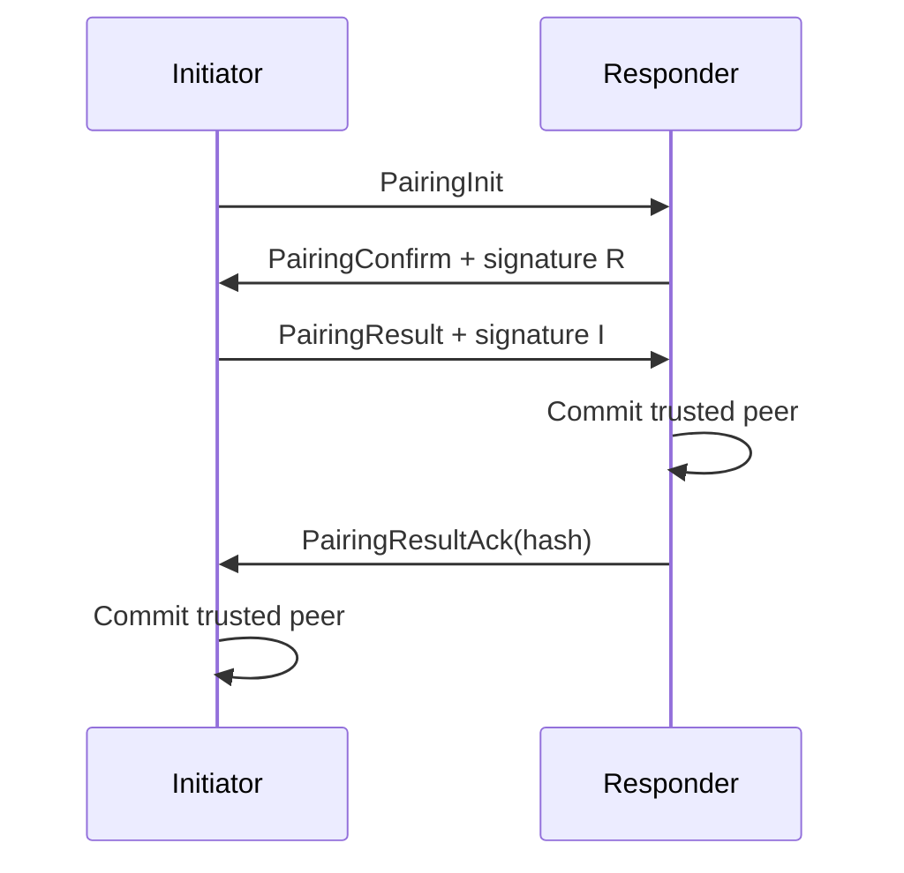

# 03 — Security, Pairing, Pinning, and Trust

Status: implemented by `privet-security`, with persistence adapters in `privet-core` and `privet-storage`.

## 1. Goals and non-goals

The security layer converts an encrypted but initially unauthenticated self-signed TLS connection into one of four application decisions: trusted code-free acceptance, first-time pairing, silent revoked rejection, or fail-closed key-mismatch alert.

It does not treat discovery claims as identity, validate a public certificate chain, provide accounts, recover keys from a cloud service, or authorize anonymous transfer.

## 2. Trust states and decisions

| Stored state and presented key | Pin decision | Connection action |
| --- | --- | --- |
| no row | `Unknown` | `TriggerPairing` |
| `Trusted`, exact SPKI match | `Trusted` | `AcceptCodeless` |
| `Trusted`, different SPKI | `KeyMismatch` | `FailClosedAlert` |
| `Revoked` | `Revoked` | `Reject` |

A revoked row is not equivalent to an absent row: it rejects connection authentication and does not automatically return to first-time pairing. Explicit forgetting removes the row; a subsequent encounter is unknown.

## 3. Pairing code policy

The normal user-visible code is a zero-padded six-digit decimal string generated from OS randomness modulo 1,000,000. The library also supports a Base32 long code with at least 16 random bytes, but the current daemon IPC exposes only decimal-code generation.

A `PairingCode` records generation time, failed cryptographic attempts, consumed state, validity duration, and maximum attempts. It is accepted only while unexpired, unconsumed, and below its failure budget. Successful pairing consumes it. Code mismatch, transcript invalidity, and invalid-key cryptographic failure increment the budget; unrelated transport failures do not.

The daemon owns one pending responder code. Generating a new code replaces the previous pending code. The responder temporarily takes the code while pairing and restores it only if it remains valid and unconsumed.

## 4. Pairing inputs

Before the PAKE session, the core extracts:

- peer certificate SPKI;
- peer fingerprint and name from encrypted `Hello`/`HelloAck`;
- 32 bytes of TLS exported keying material;
- the user-supplied pairing code.

The exporter label comes from `PairingConfig.pairing_binding_label`; the exporter context is `privet-pairing-v1`. QUIC and TCP MUST use the same label/context convention.

## 5. Pairing protocol

### 5.1 Initiator

1. Generate nonce I and start SPAKE2 role A with `(fingerprint I, fingerprint R)`.
2. Send `PairingInit` with fingerprint, TLS SPKI, SPAKE2 message, and nonce.
3. Receive `PairingConfirm`, finish SPAKE2, and calculate the canonical transcript.
4. Verify the responder signature against the SPKI extracted from TLS.
5. Send a successful `PairingResult` containing the initiator SPKI and signature.
6. Persist a pending proof and wait for an acknowledgement with the configured timeout/retry budget.
7. Commit trust only after an acknowledgement contains the exact transcript hash.

### 5.2 Responder

1. Receive `PairingInit` and require its identity SPKI to equal the initiator TLS SPKI.
2. Start SPAKE2 role B, finish with the initiator message, and generate nonce R.
3. Build the canonical transcript and send `PairingConfirm` with signature R.
4. Require a successful `PairingResult`, require its identity SPKI to equal TLS SPKI, and verify signature I.
5. Commit trust unless an identical trusted key is already present.
6. Send `PairingResultAck` with the transcript hash.

### 5.3 Acknowledgement recovery

The initiator stores `PendingProof` before waiting. It waits `pairing_ack_timeout_secs` for each attempt and resends the same successful `PairingResult` up to `pairing_max_retries`. A matching acknowledgement commits trust and clears the proof. Channel closure or retry exhaustion returns failure and clears the proof without committing.

The storage adapter persists the pending proof in an internal `core_kv` SQLite table as bincode. This table is created lazily by the adapter and is not part of schema-v1 migration SQL.

## 6. Trust record semantics

A committed peer records fingerprint, exact SPKI, display name, device-level `share_with_peers` flag, first-paired time, and last-seen time. The current pairing path always sets `share_with_peers=false`.

Revoke changes state to `Revoked` and records time/reason. Forget deletes the trust row, cascades known addresses, and leaves history by setting its foreign key to null. An authenticated connection may refresh peer name and last-seen metadata.

Re-pairing behavior is idempotent for an already trusted identical SPKI. Storage insertion does not silently overwrite an existing row; higher layers must make an explicit lifecycle decision.

## 7. Pairing configuration

| Field | Default | Runtime effect |
| --- | ---: | --- |
| `code_validity_secs` | `600` | used when daemon generates a code |
| `max_code_attempts` | `5` | used by generated-code failure budget |
| `pairing_concurrency_per_ip` | `1` | validated but not currently enforced |
| `max_pairing_attempts_per_min` | `5` | validated but not currently enforced |
| `spake2_group` | `edwards25519` | validation rejects every other value; backend is fixed |
| `pairing_binding_label` | `privet-pairing-binding` | used by QUIC/TCP TLS exporter capture |
| `pairing_ack_timeout_secs` | `30` | initiator acknowledgement timeout |
| `pairing_max_retries` | `3` | initiator acknowledgement resend budget |
| `identity_gc_stale_days` | `180` | validated but no daemon GC task currently consumes it |

Configuration rejects unknown fields, zero safety limits/timeouts, an empty binding label, unsupported group, and non-positive stale days.

## 8. Security invariants

- Both sides MUST use the same canonical initiator/responder ordering.
- Pairing message SPKI MUST equal TLS certificate SPKI.
- Pairing signatures MUST verify over the transcript hash with the claimed peer key.
- A different TLS exporter produces a different transcript, preventing a PAKE exchange from being spliced across TLS legs.
- A key mismatch for a trusted fingerprint MUST fail closed and MUST NOT modify trust state.
- Revocation rejection SHOULD avoid disclosing whether a fingerprint exists.
- Pairing events MUST NOT carry the code, SPKI private material, shared key, or exporter.

## 9. Current limitations

- Per-IP pairing concurrency and per-minute attempt limits are configuration-only; the daemon does not yet enforce them.
- Stale-identity GC candidates can be queried in storage, but the daemon does not schedule deletion or user confirmation.
- The six-digit code is returned to an authenticated local IPC client as plaintext by design; IPC endpoint security is therefore part of the pairing trust boundary.
- There is no QR payload or long-code IPC request in the current daemon.

## 10. Errors

Pairing errors distinguish code expiry/exhaustion/mismatch, already-consumed state, protocol order, transcript invalidity, key mismatch, transport failure, acknowledgement timeout, and wrapped cryptographic errors. IPC converts an unsuccessful `PairingOutcome` to `pairing_failed`; thrown core security errors use the broader `pairing` code.

## 11. Verification

Tests cover both-role success, wrong-code failure without trust, MITM exporter separation, identity binding, long-code pairing, code expiry/attempt/consumption policy, pin decisions, revoked behavior, mismatch fail-closed behavior, acknowledgement retry and exhaustion, pending proof lifecycle, trust refresh/revoke/forget, and event secrecy.

## 12. Cross-references

- Primitive definitions and transcript bytes: [02-cryptography-identity.md](02-cryptography-identity.md)
- TLS certificate/exporter sources: [05-transport.md](05-transport.md)
- SQLite trust persistence: [07-storage.md](07-storage.md)
- End-to-end pairing orchestration: [08-core-orchestration.md](08-core-orchestration.md)
